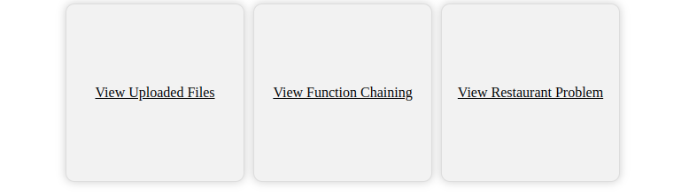
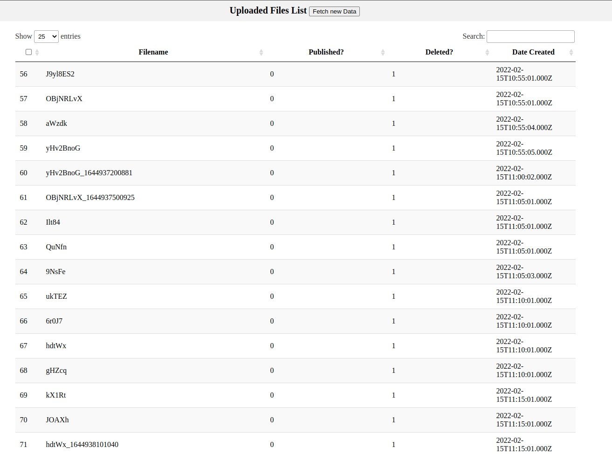
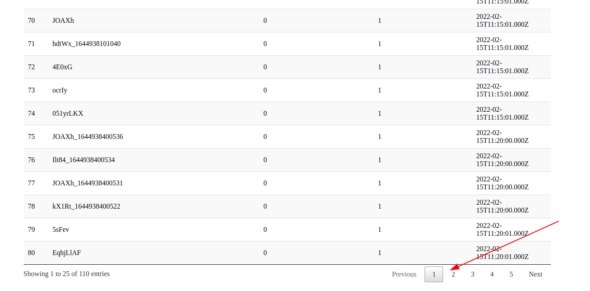

# Installation Guide - (Manually)
    
- Clone the repository using the below command
    - git clone https://github.com/Yogen-Pokhrel/reasonlabs-crawler.git

    
- Go to reasonlabs-crawler/config and enter the database credentials and enter the below command
    - npm install
    - npm install -g sequelize-cli
    - sequelize-cli db:create
    - sequelize-cli db:migrate
    - node app.js

    Hurrey! You have successfully installed the project, now you can view the outputs in browser/server console.

# Achievement

## Question 1: Please write a function (fn) that aggregate inputs (strings) and return it if there is no input for examples: 
    
    The output of the above question can be found by clicking the button "View Function Chaining" 
    on http://localhost:4000 or by clicking the url below
    http://localhost:4000/function-chain

    I wrote one function and one object such that I should not have to modify the question "console.log(fn("Hello").fn())"

## Question 2. During this test you will be required to write 2 processes that complete each other. On each process you will write code and configure environments. 

    I successfully completed the given questionare, please navigate to https://localhost:4000/list-uploaded-data to view the results. Do notice that in the short interval of time I implemented the pagination and little details. 🙂

    Given the time constraint I maintained the clean code and kept in mind about functional usualibity. There are many more which can be acheived, which can be done in future

## Question 3: The source provided resulted 404 Page.

## Question 4: Your task is to manage a Pizza restaurant - the restaurant receives an array of orders, while each order is for one Pizza that contains an array of toppings.
    
    This one was a interesting compared to rest of all, and I enjoyed writing it. I used the random order for orders serving and maintained the pipeline as
        - Dough chef ->  Topping chef -> Oven -> Serving

- Coming Features
    - Implement Socket and display the live data on the client screen

# Installation Guide - Docker

    - docker build -t crawler_app:1.0.5 .
    - docker-compose up

    -- I am not an epert on using Docker however I implemented it on this project. There may be mysql port conflict, in order to solve this you need to terminate the mysql in the local system. I would be happy to get advise to write the same in better way.