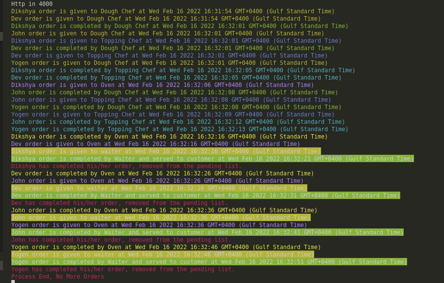

# Installation Guide - (Manually)
    
- Clone the repository using the below command
    - git clone https://github.com/Yogen-Pokhrel/reasonlabs-crawler.git

    
- Go to reasonlabs-crawler/config and enter the database credentials and enter the below command
    - npm install
    - npm install -g sequelize-cli
    - sequelize-cli db:create
    - sequelize-cli db:migrate
    - node app.js

    Hurrey! You have successfully installed the project, now you can view the outputs in browser/server console.

# Achievement

    Question 1: Please write a function (fn) that aggregate inputs (strings) and return it if there is no input for examples: 
    
    The output of the above question can be found by clicking the button "View Function Chaining" on http://localhost:4000 or by clicking the url below
    http://localhost:4000/function-chain

    

    